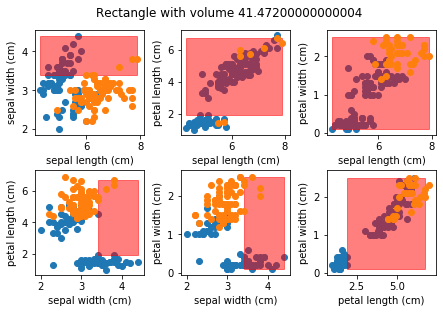

# big-holes-in-big-data

An implementation of the methods in [this paper](https://arxiv.org/pdf/1704.00683.pdf) to find empty regions in high-dimensional point clouds

Install with `python3 -m pip install big-holes-in-big-data`, which gives you access to the `HoleFinder` and `HyperRectangle` classes inside package bigholes. Then follow the [How to guide](https://pavelkomarov.com/big-holes-in-big-data/how_to_use.html) minimum viable example.

